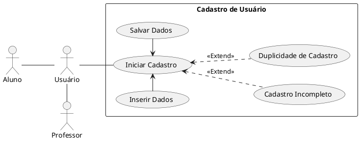
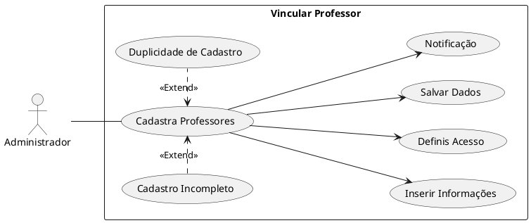
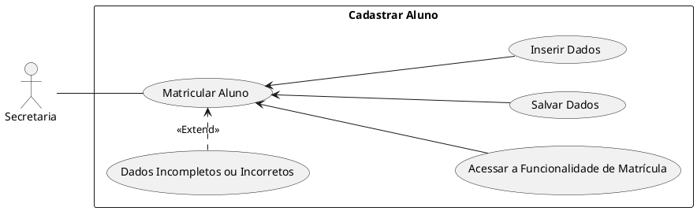
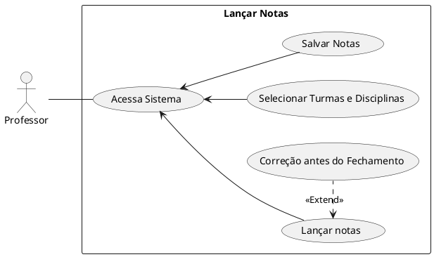
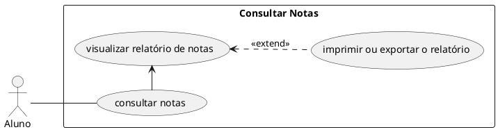

## 1. Diagrama de casos de uso

## 1. Cadastro de Usuário

## 2. Vincular Professor

## 3. Matricular Aluno

## 4. Lançar Notas

## 5. Consultar Notas

## 2. Descrições dos casos de uso

## 1 - Caso de Uso: Cadastro de usuário
Ator Primário: Usuário
Descrição: O próprio usuário do sistema (seja aluno/professor) realiza seu cadastro inicial preenchendo seus dados pessoais e o tipo de usuário que ele se enquadra.
Pré-condições: O sistema deve estar acessível.
Fluxo Principal: Iniciar Cadastro: O usuário acessa a funcionalidade "Cadastrar Professor" ou "Cadastrar Aluno" no sistema.
Inserir Informações: O usuário insere os dados necessários, como nome completo, e-mail, telefone, tipo de usuário e outras informações relevantes.
Salvar Dados: O usuário confirma e salva o cadastro no sistema.
Fluxo Alternativo: Dados Incompletos ou Inválidos: Se algum campo obrigatório não for preenchido ou contiver dados inválidos, o sistema deve alertar o usuário e impedir o cadastro até que todas as informações estejam corretas.
Duplicidade de Cadastro: Se o e-mail ou o nome de usuário e tipo de cadastro já estiverem cadastrados no sistema, o sistema deve notificar o administrador e solicitar uma revisão antes de continuar.

## 2 - Caso de Uso: Vincular Professor
Ator Primário: Administrador
Descrição: O Administrador pode vincular novos professores, a determinadas disciplinas, inserindo informações como nome, disciplina(s) que leciona. Após o cadastro, o professor pode acessar o sistema para lançar notas e consultar turmas.
Pré-condições: O sistema deve estar acessível e o administrador deve estar autenticado com as permissões adequadas.
Fluxo Principal:
Iniciar Cadastro: O administrador acessa a funcionalidade "Cadastrar Professor" no sistema.
Inserir Informações: O administrador insere os dados necessários, como nome completo, disciplinas que o professor irá lecionar, e-mail, telefone, e outras informações relevantes.
Definir Acesso: O administrador cria as credenciais de acesso (nome de usuário e senha) para o professor.
Salvar Dados: O administrador confirma e salva o cadastro no sistema.
Notificação: O sistema envia automaticamente um e-mail para o professor com as credenciais de acesso e instruções para o primeiro login.
Fluxo Alternativo:
Dados Incompletos ou Inválidos: Se algum campo obrigatório não for preenchido ou contiver dados inválidos, o sistema deve alertar o administrador e impedir o cadastro até que todas as informações estejam corretas.
Duplicidade de Cadastro: Se o e-mail ou o nome de usuário já estiverem cadastrados no sistema, o sistema deve notificar o administrador e solicitar uma revisão antes de continuar.

## 3 - Caso de Uso: Matricular Aluno
Ator Primário: Secretaria
Descrição: A Secretaria pode matricular um novo aluno em uma turma vinculado a uma ou mais disciplinas.
Pré-condições: O sistema deve estar acessível e o usuário autenticado com permissões de secretaria.
Fluxo Principal:
Matricular aluno.
Acessar a funcionalidade de matricula.
Inserir os dados do aluno.
Inserir os dados de turma, selecionar disciplina.
Salvar os dados no sistema.
Fluxo Alternativo:
Se os dados estiverem incompletos ou incorretos, o sistema deve alertar e impedir a matrícula até que todas as informações sejam corretamente preenchidas.

## 4 - Caso de Uso: Lançar Notas
Ator Primário: Professor
Descrição: Professores podem lançar as notas dos alunos em disciplinas específicas. As notas podem ser alteradas até a data de fechamento do período avaliativo.
Pré-condições: O sistema deve estar acessível, o professor autenticado, e as turmas e disciplinas devem estar previamente cadastradas.
Fluxo Principal:
Acessar a funcionalidade de lançamento de notas.
Selecionar a turma e disciplina.
Inserir as notas dos alunos.
Salvar as notas no sistema.
Fluxo Alternativo: 
Se uma nota for inserida incorretamente, o sistema permite a correção antes do fechamento do período.

## 5 - Caso de Uso: Consultar Notas
Ator Primário: Aluno
Descrição: Alunos podem consultar suas notas através do sistema, acessando um relatório detalhado por disciplina e período.
Pré-condições: O aluno deve estar autenticado no sistema.
Fluxo Principal:
Acessar a funcionalidade de consulta de notas.
Visualizar o relatório de notas.
Imprimir ou exportar o relatório, se necessário.

