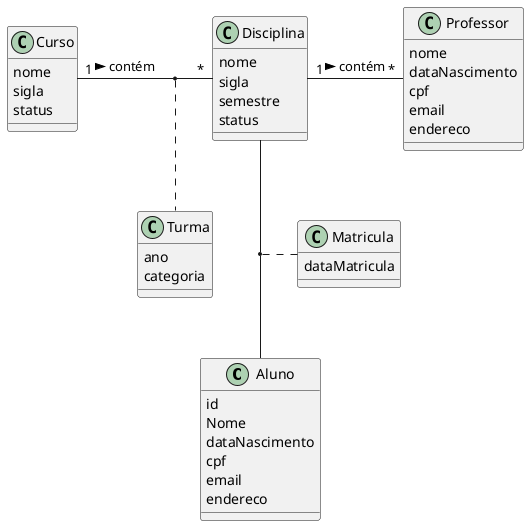

## 3. Modelo de domínio

```plantuml
@startuml
class Aluno
Aluno : id
Aluno : Nome
Aluno : dataNascimento
Aluno : cpf
Aluno : email
Aluno : endereco

class Professor
Professor : nome
Professor : dataNascimento
Professor : cpf
Professor : email
Professor : endereco

class Curso
Curso : nome
Curso : sigla
Curso : status

class Disciplina
Disciplina : nome
Disciplina : sigla
Disciplina : semestre
Disciplina : status

class Turma
Turma : ano
Turma : categoria

class Matricula
Matricula : dataMatricula


Curso "1" - "*" Disciplina : contém >
Disciplina "1" - "*" Professor : contém >
(Disciplina, Aluno) .. Matricula

(Disciplina, Curso) .. Turma

@enduml

```

