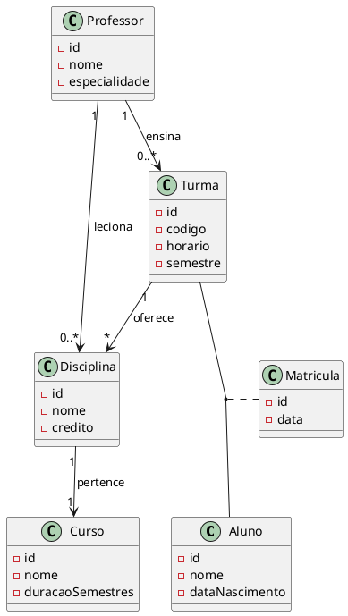

## 3. Modelo de domínio

```plantuml
@startuml
class Aluno {
  -id
  -nome
  -dataNascimento
}

class Professor {
  -id
  -nome
  -especialidade
}

class Curso {
  -id
  -nome
  -duracaoSemestres
}

class Disciplina {
  -id
  -nome
  -credito
}

class Turma {
  -id
  -codigo
  -horario
  -semestre
}

class Matricula {
  -id
  -data
}

(Turma, Aluno) .. Matricula
Turma "1" --> "*" Disciplina: oferece
Disciplina "1" --> "1" Curso: pertence
Professor "1" --> "0..*" Turma: ensina
Professor "1" --> "0..*" Disciplina: leciona

@enduml

```

