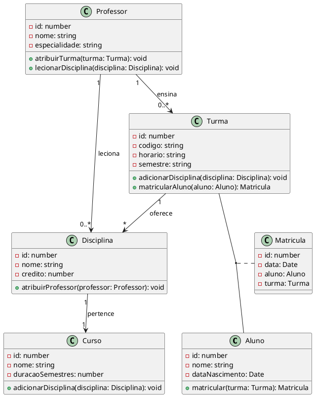

## 5. Diagramas de classes de projeto

Abaixo, o diagrama de classes do nosso projeto:

```plantuml
@startuml
class Aluno {
  -id: number
  -nome: string
  -dataNascimento: Date
  +matricular(turma: Turma): Matricula
}

class Professor {
  -id: number
  -nome: string
  -especialidade: string
  +atribuirTurma(turma: Turma): void
  +lecionarDisciplina(disciplina: Disciplina): void
}

class Curso {
  -id: number
  -nome: string
  -duracaoSemestres: number
  +adicionarDisciplina(disciplina: Disciplina): void
}

class Disciplina {
  -id: number
  -nome: string
  -credito: number
  +atribuirProfessor(professor: Professor): void
}

class Turma {
  -id: number
  -codigo: string
  -horario: string
  -semestre: string
  +adicionarDisciplina(disciplina: Disciplina): void
  +matricularAluno(aluno: Aluno): Matricula
}

class Matricula {
  -id: number
  -data: Date
  -aluno: Aluno
  -turma: Turma
}

(Turma, Aluno) .. Matricula
Turma "1" --> "*" Disciplina: oferece
Disciplina "1" --> "1" Curso: pertence
Professor "1" --> "0..*" Turma: ensina
Professor "1" --> "0..*" Disciplina: leciona


@enduml
```

